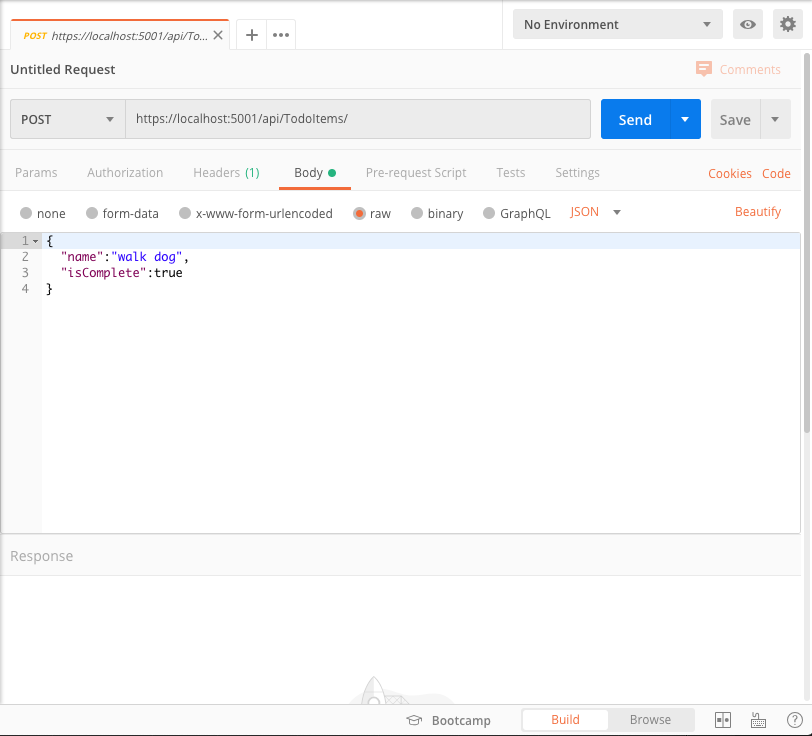
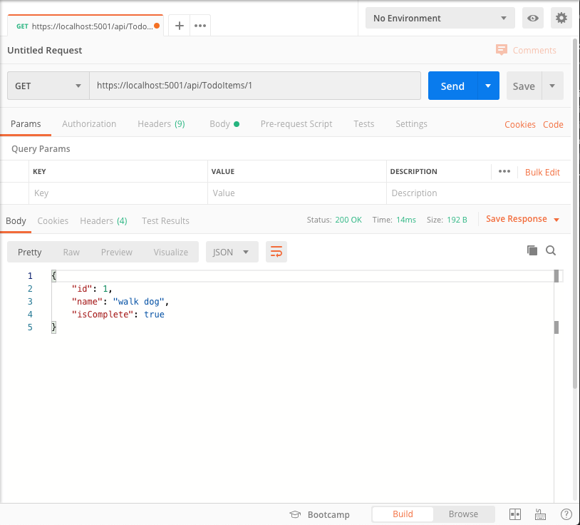

# TodoApi
This was a quick and simple API I built while learning .NET

## What I did
1. Open the project in vscode
2. Start the server `CTRL + F5`
3. A local database will be created. I used [postman](https://www.postman.com) to test stuff.
4. Post some sample data to the API:

5. Now try to get the data:

